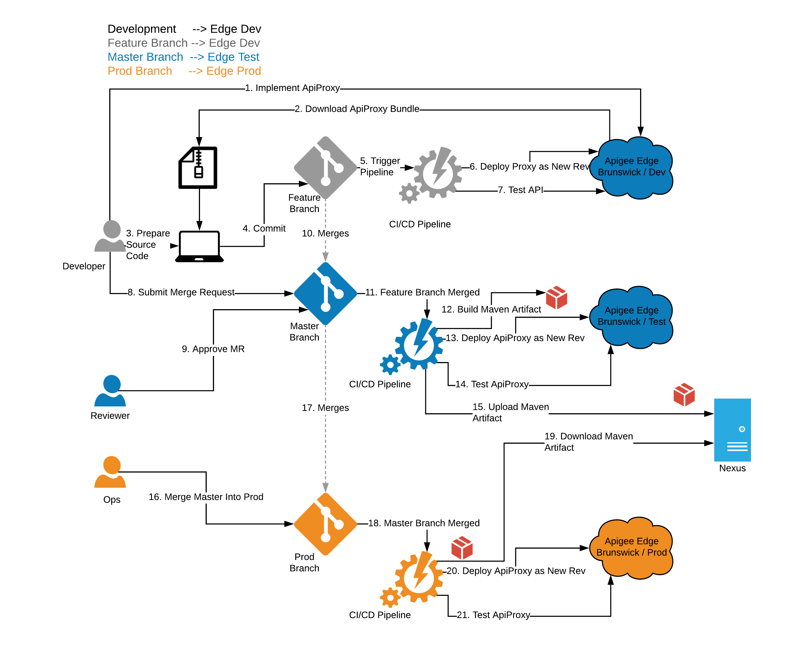
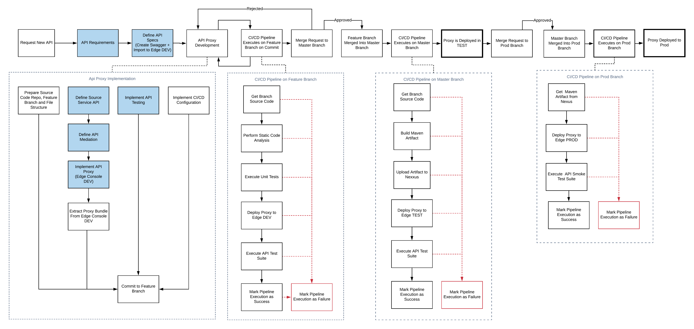
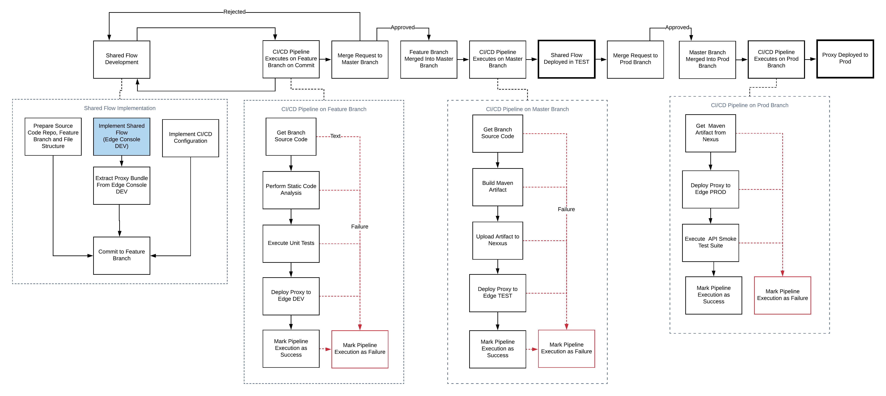

<h1>Apigee Development Process</h1>


Brunswick Corporation - Apigee Development Process
Version:  1.0 Draft


> Important. This document is a draft. Content is subject to change based on reviews, feedback and experience.
 
# 1. Overview

High level process for Apigee Development.



# 2. Goal

Define an API development process based on Agile practices implemented on the Apigee Edge Platform.

# 3. Process



## 3.1. Environments

Currently there are three Apigee Edge environments available. This has some limitations as one environment would need to be used for multiple purposes; which might lead to inconsistencies and conflicts.

* `dev (feature branch)` - Edge Console development and `feature` branch CI.
* `test (master branch)` - Stable integration and QA environment.
* `prod (prod branch)` - Production

Eventually we can move a more convenient schema, as described below:

* `sandbox` - Edge console development
* `int (feature branch)` - `feature` branch CI.
* `dev (master branch)` - Stable Integration Environment.
* `test (test branch)` - QA
* `prod (prod branch)` - Production.
 
# 4. Roles and Responsabilities

* Apigee Developer
* Reviewer
* Ops

## 4.1. Apigee Developer Access Level

TODO: Define what's the access level on the Apigee Edge platform for developers. (proxies, products, config, etc.)

# 5. Assumptions

* Source system definition and implementation is out of the scope.
* Source System Specs (Swagger) should be available for the proxy implementation.

## 5.1. API Requirements

## 5.2. Define API Specs (Swagger)

Design API Specs using Swagger.

`TODO: Add reference links`

### 5.2.1. Coding Standars and Conventions

* The Swagger file should be in Yaml format.
* The Swagger file should be named as follows:
  * `<business>-<domain/process>-api.yaml` where:
    * `business` is the area where the proxy belongs to. Use `brunswick` if it does not belong to a particular area.
    * `domain/process` is the business domain or the process where the API belongs to. Use a singular noun, if possible.
    For example: `bbg-engine-api`
* Use plural nouns for resources defined in the specs.
* Define pagination for operations that return collections, defining default and limit values.
* Define filtering and sorting for operations that return collections.
* Define mechanism to expand aggregate resources on demand.

## 5.3. Api Proxy Development

### 5.3.1. ApiProxy Implementation

At this point there should be a defined API in Swagger format.

#### 5.3.1.1. Source Code Repository

All the Edge Proxies reside in the `apigee-api-proxies` main repository. Each proxy has its own repository with the below structure.

There should be only one repo to implement a single API.

##### 5.3.1.1.1. File Structure

This file structure based on the structure defined in the `apigee-deploy-maven-plugin` Maven plugin.

See more details on https://github.com/apigee/apigee-deploy-maven-plugin

```text

apigee-api-proxies
    ├── apigee-api-proxy-parent-pom
    |   └── pom.xml -- POM shared by all the proxies
    └── <proxyname> -- The name of the API proxy implemented in this repo
        └── src
            └── gateway
                ├── specs
                |   └── <business>-<domain/process>-api.yaml -- API specs implemented by this proxy
                |
                ├── target_api
                |   └── <target_system>-api.yaml -- API specs from the source system API
                |
                ├── apiproxy
                |   ├── proxies
                |   ├── resources
                |   |   └── jsc
                |   ├── policies
                |   ├── targets
                |   └── <proxyname>.xml
                |   
                ├── config.json -- Config values replaced in proxy's XML files at build by Maven
                ├── tests
                └── pom.xml
```

#### 5.3.1.2. Define Source Service API

Get the API Specs (Swagger) from the Source Service to define the integration.

#### 5.3.1.3. Define API Mediation

Based on the business process defined by the API Specs define what business logic needs to be implemented and what technical requirements need to be implemented as part of the proxy.

* Security
* CORS
* Caching
* Error Handling
* Request Transformation
* Configuration
* Response Transformation
* Logging
* Shared Flows: Implement/Reuse

#### 5.3.1.4. Implement API Proxy

Use the DEV environment of the Apigee Console to implement the API Proxy.

See the sections to implement shared flows and global configuration if there is a dependency on them for this proxy implementation.

##### 5.3.1.4.1. Coding Standards and Conventions

* The API specs should be implemented by a single proxy only.
* The proxy should be named after the API, as follows:
  `<business>-<domain/process>-api-proxy`, for example `bbg-engine-api-proxy`.
* The basepath should match the API name. For example: `bbg-engine-api`.
* Target servers should be configured as environment configuration.
* Use lowercase letters, numbers and dashes to name policies and resources. Use meaningful names.
* If available, use the target API specs (Swagger) for mocking

##### 5.3.1.4.2. Security

* Use oAuth to secure the API proxy
* Use oAuth scopes to protect each operation of the proxy.

See more on https://docs.apigee.com/api-platform/fundamentals/best-practices-api-proxy-design-and-development

#### 5.3.1.5. Extract API Proxy Bundle

Once you're happy with your proxy, you can download a zipped bundle and use it to place it in the file structure defined above.

#### 5.3.1.6. Maven

These are instructions to deploy a proxy using Maven. These commands should be used in the CI/CD pipelines.

#### 5.3.1.7. Configure

```

cd /path/to/repo/src/gateway

mvn clean package apigee-enterprise:configure -P<env>

TODO: Configure organization in Maven profile
```

#### 5.3.1.8. Deploy

```
mvn apigee-enterprise:deploy -P<env> -Dusername=<apigee_username> -Dpassword=<apigee_password> -Dorg=<org>

```

#### 5.3.1.9. Commit to Feature Branch

Commit code to feature branch. CI pipeline executes on this branch. If it is sucessful, you can submit a merge request to `master` branch.

#### 5.3.1.10. API Product Configuration

An important part of the API proxy development is to make it available to developers. You can publish your API proxy by creating API Products. An API product defines some aspects regarding how an API can be accessed.

You can find more information about API Products and how make them aviailable to developers in the "API Publish And Self-Service" section below.

#### 5.3.1.11. Implement API Testing

Implementation of API test cases is based on `apickli`.

`apickli` is a REST API integration testing framework. See more details on https://github.com/apickli/apickli

##### 5.3.1.11.1. Standards and Conventions

TODO: Define guidelines

##### 5.3.1.11.2. Testing App

TODO: Add instructions to create a test app that can be used to access the API Proxy to run the tests. See "API Publish And Self-Service" section below.

### 5.3.2. Shared Flow Implementation



#### 5.3.2.1. Source Code Repository

All the Shared Flows reside in the `apigee-shared-flows` main repository. Each shared flow has its own repository with the below structure:

There should be only one repo to implement a single shared flow.

##### 5.3.2.1.1. File Structure

This file structure based on the structure defined in the `apigee-deploy-maven-plugin` Maven plugin.

See more details on https://github.com/apigee/apigee-deploy-maven-plugin

```text

apigee-shared-flows
    ├── apigee-shared-flow-parent-pom
    |   └── pom.xml
    └── <business>-<domain/process/aspect>-shared-flow
        └── src
            ├── sharedflowbundle
            |   ├── policies
            |   ├── sharedflows
            |   └── <business>-<domain/process/aspect>-shared-flow.xml
            |
            ├── config.json -- Config values replaced in SharedFlow's XML files at build time by Maven
            └── pom.xml
```
##### 5.3.2.1.2. Standards and Conventions

* The shared flow should be named according to the following format:
  `<business>-<domain/process>-shared-flow`, for example `brunswick-security-shared-flow`.
* Use lowercase letters, numbers and dashes to name policies and resources. Use meaningful names.

### 5.3.3. Global Configuration

TODO: Add process diagram

#### 5.3.3.1. Source Code Repository

All config resides in the  `apigee-config` main repository. There's a global config repo that contains all the global configuration values used accross all enviroments.
It also stores API specific config values.
Optionally, there can be specific repositories dedicated to store a single API config values.

##### 5.3.3.1.1. File Structure

This file structure based on the structure defined in the `apigee-config-maven-plugin` Maven plugin.

See more details on https://github.com/apigee/apigee-config-maven-plugin

```text
apigee-config
├── apigee-config-parent-pom
|   └── pom.xml
├── apigee-global-config
|   └── resources
|       ├── edge
|       │    ├── org
|       │    │   ├── apiProducts.json
|       │    │   ├── developerApps.json
|       │    │   ├── developers.json
|       │    │   ├── kvms.json
|       │    │   └── maskconfigs.json
|       │    ├── env
|       │    │   ├── test
|       │    │   │   ├── caches.json
|       │    │   │   ├── kvms.json
|       │    │   │   └── targetServers.json
|       │    │   └── prod
|       │    │       ├── caches.json
|       │    │       ├── kvms.json
|       │    │       └── targetServers.json
|       │    └── api
|       │        ├── api-1
|       │        │   ├── caches.json
|       │        │   └── maskconfigs.json
|       │        └── api-2
|       │            ├── caches.json
|       │            └── maskconfigs.json
|       └── pom.xml
└── api-1-config
    └── resources
        └── edge
            └── api
                └── api-1
                    ├── caches.json
                    └── maskconfigs.json
```
#### 5.3.3.2. API Products

TODO: Describe configuration

See the "API Publish And Self-Service" section.

#### 5.3.3.3. Target Servers

TODO: Describe configuration

#### 5.3.3.4. Virtual Hosts

TODO: Describe configuration

#### 5.3.3.5. KVM

TODO: Describe configuration

#### 5.3.3.6. Resource Files

TODO: Describe configuration

#### 5.3.3.7. Caches

TODO: Describe configuration

### 5.3.4. Apigee Edge Microgateway Custom Plugins

TODO: Add process diagram

Edge Microservice custom plugins reside in the `apigee-micro-plugins` main repository.

```
apigee-micro-plugins
    ├── README.md
    ├── apigee-micro-parent-pom
    |   └── pom.xml
    |-<integration>-api-plugin
        └── src
            |   ├── index.js
            |   ├── package.json
            |   ├── resource-1.js
            |   └── resource-N.json
            |
            ├── test
            └── pom.xml
```

#### 5.3.4.1. Standards and Conventions

TODO: add guidelines

### 5.3.5. Apigee Edge Microgateway Configuration

TODO: Add process diagram

This is to version control the configuration used by the Microgateway in each environment. Pipelines can be created with its changed so the Microgateway gets updated.

```
apigee-micro-config
    ├── README.md
    ├── apigee-micro-parent-pom
    |   └── pom.xml
    └── <business>-<process>-micro-config
        ├── dev
        |   ├── service
        |   |   └─<business>-dev-config.yaml
        ├── test
        |   ├── service
        |   |   └─<business>-test-config.yaml
        └── prod
            └── service
                └─<business>-prod-config.yaml
```

# 6. API Publish and the Developer Portal

TODO: Describe the process to publish an API using API Products as well as the Self-Service process that includes the generation of the Developer Portal for developers to gain access to APIs.

## 6.1. API Products

TODO: Describe how to publish an API using API products and how deploy an API product.

### 6.1.1. Security

### 6.1.2. Scopes


## 6.2. Standards and Conventions

TODO: Add guidelines for API products.

## 6.3. Developer Portal

TODO: Explain the process to create developer portals.

## 6.4. Developers

TODO: describe the developer role

## 6.5. Apps

TODO: describe the Apps role.

### 6.5.1. API Keys

TODO: describe what the API keys are.

### 6.5.2. API Secrets
TODO: describe what the API secrets are.

### 6.5.3. App Registration
TODO: describle the process to register an App to an API product.

### 6.5.4. oAuth2 Access Tokens

TODO: describe the process to get oAuth2 access tokens for Apps.

# 7. Security

## 7.1. oAuth2

Add oAuth verification to each API proxy.

## 7.2. Definition of Scopes

Use the following scopes to protect individual operations on the API Proxies. This will add flexibility to create products with specific access level.

* `api.read` - GET 
* `api.write` - POST/PUT/PATCH
* `api.delete` - DELETE

# 8. Maven Integration

Maven tool is used as the build and deploy mechanism for the Apigee Edge. This section defines the approach followed in the development process.

## 8.1. Parent POM

There should be a parent POM for each category of Apigee deployment unit. So that we have specific definitios for each type.

### 8.1.1. Profiles

Maven profiles defined in the parent POM should match the environmens for the Apigee development process.

They should match the name of the environment. Assuming that there are three environments named `dev`, `test` and `prod`, there should be three Maven profiles named identically.

### 8.1.2. Plugin Definition

The parent POM defines the plugins needed to deploy the type of component.

### 8.1.3. Repositories

The parent POM also defines the Maven repositories.

## 8.2. Children POM

There is a POM file for each source code repository which extends the parent POM.

## 8.3. Group IDs

TODO: Add group id scheme.

## 8.4. Artifact IDs

TODO: Add artificat id naming.

# 9. Configuration Management

## 9.1. Source Control

GIT repositories.

## 9.2. Branching
TODO: Add descriptions
### 9.2.1. feature
### 9.2.2. fix
### 9.2.3. master
### 9.2.4. test
### 9.2.5. prod

## 9.3. Versioning

TBD

# 10. Issues

* How map the Maven artifact release version to the revision in Edge?